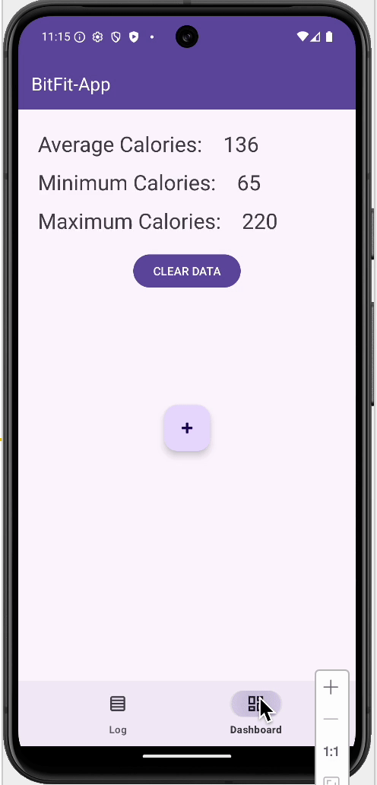

# Android Project 6 - **BitFit-App**

Submitted by: **Jose Valle**

**BitFit-App** is a health metrics app that allows users to track their daily food intake and automatically view calorie statistics. It extends the original BitFit app by adding multi-screen navigation with fragments, a dashboard for calorie summaries, and persistent storage using Room.

Time spent: **8.5+ hours** spent in total

---

## Required Features

The following **required** functionality is completed:

- [x] **Uses at least 2 Fragments** (`LogFragment` and `DashboardFragment`)
- [x] **Creates a dashboard fragment where users can see a summary of their entered data**
- [x] **Uses BottomNavigationView to move between fragments**
- [x] **Data is saved in a Room database and persists after app restarts**
- [x] **Implements live database observation for instant UI updates**

---

## Optional Features

The following **optional** features are implemented:

- [x] **Improved UI design with Material color theming and icons**
- [x] **Added input validation (requires name + numeric calories)**
- [x] **“Clear Data” button to delete all entries and refresh dashboard**
- [ ] **Graph visualization for calorie trends (planned with MPAndroidChart)**
- [ ] **Daily notifications for entry reminders**

---

## Additional Features

The following **additional** features are implemented:

- [x] **Uses ViewBinding and LifecycleScope for safer UI updates**
- [x] **Real-time updates across fragments via LiveData observation**
- [x] **Consistent navigation behavior using Android Navigation Component**

---

## Video Walkthrough

Here's a walkthrough of implemented user stories:

GIF created with [Kap](https://getkap.co/) for macOS

---

## Notes

The main challenges were:
- Configuring the Room database correctly to resolve missing reference errors
- Managing navigation between fragments using BottomNavigationView
- Handling Kotlin coroutine scopes for live data observation
- Ensuring UI consistency between fragments after clearing database data

---

## License

    Copyright 2025 Jose Valle

    Licensed under the Apache License, Version 2.0 (the "License");
    you may not use this file except in compliance with the License.
    You may obtain a copy of the License at

        http://www.apache.org/licenses/LICENSE-2.0

    Unless required by applicable law or agreed to in writing, software
    distributed under the License is distributed on an "AS IS" BASIS,
    WITHOUT WARRANTIES OR CONDITIONS OF ANY KIND, either express or implied.
    See the License for the specific language governing permissions and
    limitations under the License.
